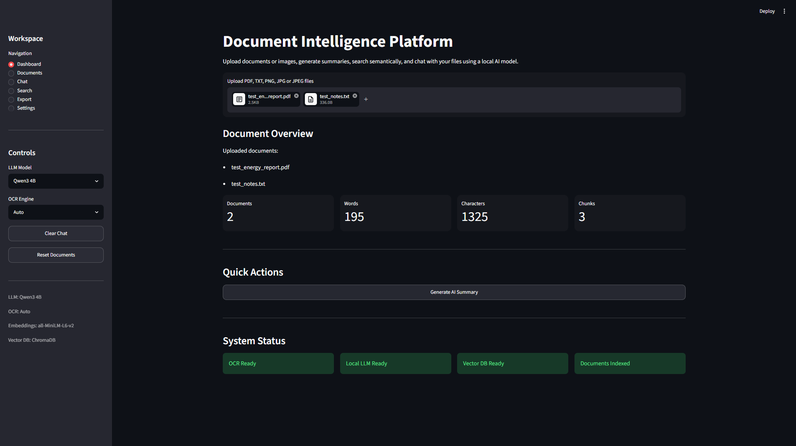
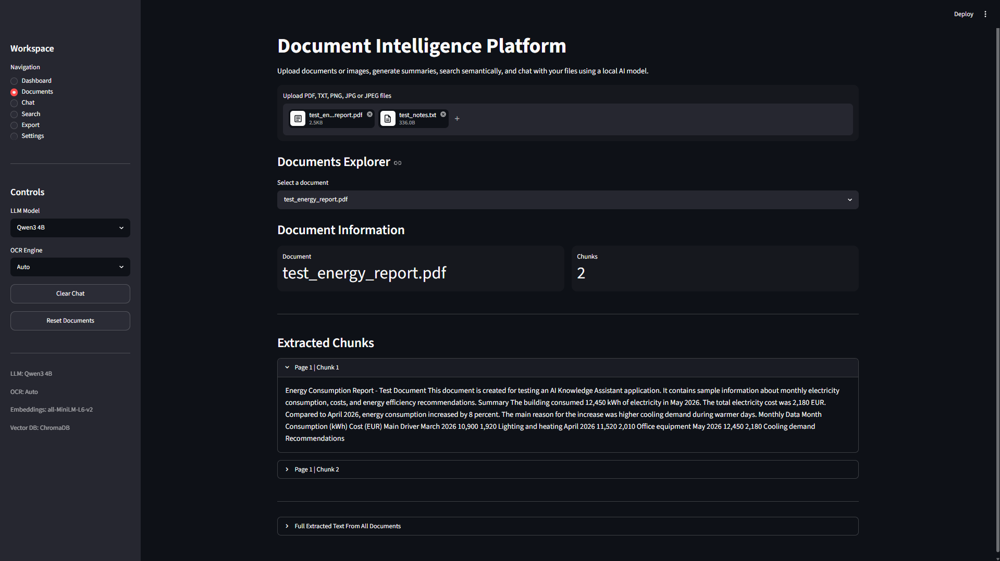
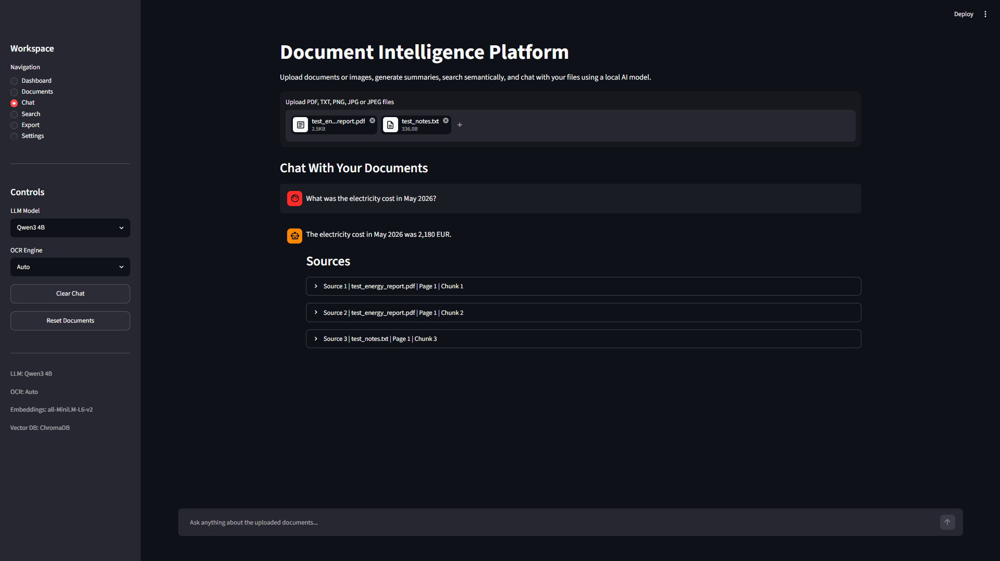
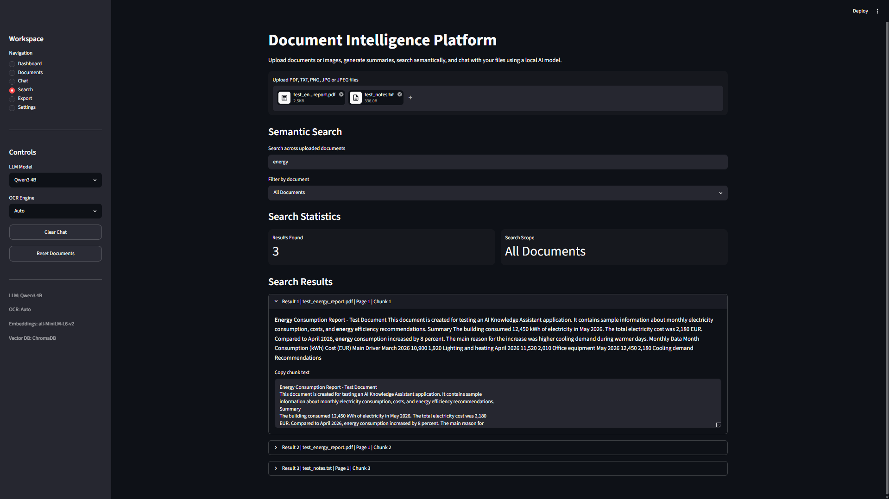
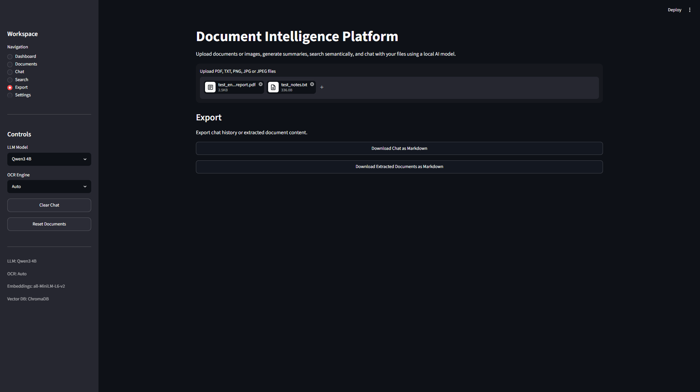
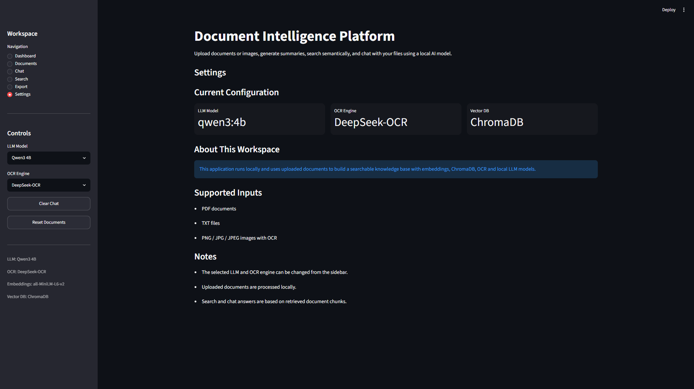

# Document Intelligence Platform

A local AI-powered document assistant built with Python and Streamlit. The application allows users to upload documents or images, extract text using OCR, generate AI summaries, perform semantic search, and chat with their documents using a local Large Language Model.

---

## Features

- Upload PDF, TXT and image files
- OCR support for scanned images
- AI-generated document summaries
- Semantic search using vector embeddings
- Chat with uploaded documents
- Source citation for AI responses
- Markdown export for chat history and extracted documents
- Multiple local LLM and OCR engine support
- Fully local processing (no cloud services)

---

## Technologies

| Category | Technology |
|----------|------------|
| Frontend | Streamlit |
| Language | Python 3.13 |
| LLM | Ollama (Qwen3, Llama3) |
| OCR | GLM-OCR, DeepSeek-OCR |
| Embeddings | all-MiniLM-L6-v2 |
| Vector Database | ChromaDB |
| Document Processing | PyMuPDF, Pillow |
| Search | Semantic Vector Search |

---

## Installation

Clone the repository

```bash
git clone https://github.com/angelchoxd/Document-Intelligence-Platform.git
cd Document-Intelligence-Platform
```

Create a virtual environment

```bash
python -m venv .venv
```

Activate the environment

Windows

```bash
.venv\Scripts\activate
```

Install dependencies

```bash
pip install -r requirements.txt
```

Make sure Ollama is installed and the required models are available.

Run the application

```bash
streamlit run app.py
```

---

## Supported File Types

- PDF
- TXT
- PNG
- JPG
- JPEG

---

## Sample Documents

The repository includes sample documents inside the `sample_documents/` folder so you can immediately test the application.

Included examples:

- test_energy_report.pdf
- test_notes.txt

These files can be used to test document upload, OCR, semantic search, AI summaries, and chat functionality immediately after installation.

---

## Screenshots

### Dashboard



---

### Documents



---

### Chat



---

### Semantic Search



---

### Export



---

### Settings



---

## Project Structure

```text
AI-Knowledge-Assistant/
│
├── sample_documents/
├── screenshots/
├── ui/
├── app.py
├── llm.py
├── ocr_engine.py
├── document_loader.py
├── document_explorer.py
├── vector_store.py
├── export_utils.py
├── prompts.py
├── config.py
├── requirements.txt
└── README.md
```

---

## Future Improvements

- Support additional OCR engines
- Multi-user authentication
- PDF annotation
- Reranking for semantic search
- Conversation memory
- REST API support
- Docker deployment

---

## License

This project is intended for educational and portfolio purposes.